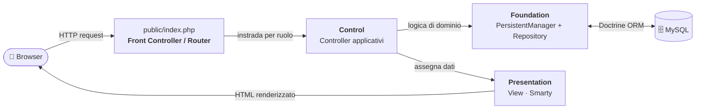
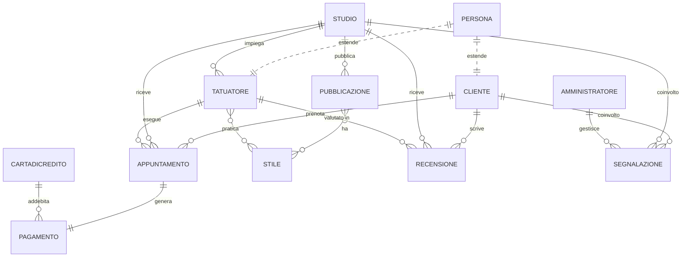

<div align="center">

# 🖋️ InkMaster

**Piattaforma web per la prenotazione di tatuaggi e la gestione di studi di tattooing.**

Mette in contatto i clienti con gli studi: ricerca per città e stile, esplorazione dei portfolio, prenotazione degli appuntamenti, pagamenti, recensioni e moderazione della piattaforma.


</div>

---

## 📑 Indice

- [Descrizione](#-descrizione)
- [Funzionalità](#-funzionalità)
- [Stack tecnologico](#-stack-tecnologico)
- [Architettura](#-architettura)
- [Struttura del progetto](#-struttura-del-progetto)
- [Modello dei dati](#-modello-dei-dati)
- [Requisiti](#-requisiti)
- [Installazione e avvio in locale](#-installazione-e-avvio-in-locale)
- [Popolamento del database](#-popolamento-del-database-seed)
- [Account di test](#-account-di-test)
- [Autori](#-autori)

---

## 📖 Descrizione

**InkMaster** è un applicativo web sviluppato come progetto del corso di **Programmazione Web**. L'obiettivo è offrire un servizio completo di prenotazione di tatuaggi, modellando i tre attori del dominio e i loro flussi operativi:

- 🧑 **Cliente** — cerca uno studio, ne consulta il portfolio, prenota un appuntamento con un tatuatore, paga e lascia una recensione.
- 🎨 **Studio** — gestisce il proprio team di tatuatori, pubblica le opere nel portfolio, accetta o rifiuta le richieste di appuntamento, registra i pagamenti.
- 🛡️ **Amministratore** — modera la piattaforma tramite una dashboard con statistiche, gestisce le segnalazioni e applica o rimuove i ban.

L'applicazione è progettata secondo un'architettura a livelli (pattern **MVC** con front controller) e utilizza **Doctrine ORM** per la persistenza e **Smarty** come template engine.

---

## ✨ Funzionalità

### 🧑 Area Cliente
| Funzionalità | Descrizione |
|---|---|
| Registrazione & Login | Creazione account cliente con validazione, autenticazione sicura (hash bcrypt) |
| Ricerca studi | Filtri per **città**, **stile** e ricerca **testuale** |
| Visualizzazione studio | Profilo dello studio, team, recensioni e portfolio pubblico |
| Portfolio pubblico | Galleria delle opere con dettaglio (stile, posizione, dimensione) |
| Prenotazione guidata | Flusso a step: scelta tatuatore → stile → data → descrizione → riepilogo |
| Pagamento | Inserimento dati carta e registrazione del pagamento |
| Recensioni | Pubblicazione di recensioni con voto, testo e foto |
| Area personale | Storico appuntamenti e recensioni del cliente |
| Segnalazioni | Segnalazione di studi per comportamenti scorretti |

### 🎨 Area Studio
| Funzionalità | Descrizione |
|---|---|
| Registrazione studio | Onboarding con **Partita IVA** (validazione 11 cifre) |
| Dashboard | Pannello di controllo con accesso rapido alle sezioni |
| Gestione portfolio | Pubblicazione ed eliminazione delle opere (con upload immagini) |
| Gestione richieste | Accettazione/rifiuto delle richieste di appuntamento |
| Gestione pagamenti | Abilitazione pagamento e storico incassi |
| Gestione team | Aggiunta/rimozione tatuatori e relativi stili |
| Storico appuntamenti | Elenco completo filtrabile per stato |

### 🛡️ Area Amministratore
| Funzionalità | Descrizione |
|---|---|
| Dashboard moderazione | KPI piattaforma (utenti, studi, segnalazioni, prenotazioni) e grafici |
| Gestione segnalazioni | Elenco segnalazioni aperte/chiuse con dettaglio |
| Ban & Sban | Sospensione di clienti/studi con motivazione e gravità, rimozione ban |

---

## 🛠️ Stack tecnologico

| Categoria | Tecnologia |
|---|---|
| **Linguaggio** | PHP 8.1+ (enum, typed properties, attributi) |
| **ORM** | Doctrine ORM 3.x + DBAL 4 |
| **Template engine** | Smarty 5.x |
| **Cache** | Symfony Cache 7 |
| **Database** | MySQL |
| **Dependency manager** | Composer (autoload PSR-4) |
| **Front-end** | HTML5, CSS3 (vanilla, un foglio per pagina), grafica SVG |
| **Hosting** | InfinityFree (hosting PHP/MySQL condiviso) |

---

## 🏗️ Architettura

Il progetto adotta un'architettura **a livelli** con pattern **MVC** e un unico punto di ingresso (*front controller*). Ogni richiesta HTTP passa per `public/index.php`, che instrada verso il controller competente; questo orchestra la logica applicativa, accede ai dati tramite il `PersistentManager` e delega il rendering alla `View` (Smarty).



**Livelli applicativi:**

| Livello | Cartella | Responsabilità |
|---|---|---|
| **Presentation** | `templates/`, `src/Presentation/` | Template Smarty e rendering delle viste |
| **Control** | `src/Control/` | Controller organizzati per attore (Cliente, Studio, Comune, Amministratore) |
| **Foundation** | `src/Foundation/` | `PersistentManager` (facciata sui Repository Doctrine) e `SessionManager` |
| **Entity** | `src/Entity/` | Modello di dominio (entità Doctrine mappate via attributi) |

> Il `PersistentManager` è l'**unico punto di accesso al database**: i controller dialogano solo con esso, mai con i repository direttamente. Questo isola la logica di persistenza dal resto dell'applicazione.

---

## 📂 Struttura del progetto

```
InkMaster/
├── config/                        # Bootstrap dell'applicazione
│   ├── bootstrap-doctrine.php     # EntityManager + connessione al DB
│   ├── bootstrap-smarty.php       # Configurazione del template engine
│   └── cli-config.php             # Console Doctrine (schema/migrazioni)
├── public/                        # Document root (esposta dal web server)
│   ├── index.php                  # Front controller / router
│   ├── favicon.svg
│   ├── CSS/                       # Fogli di stile (uno per pagina)
│   └── img/                       # Immagini caricate (tatuaggi, recensioni)
├── src/
│   ├── Entity/                    # Entità di dominio (Doctrine ORM)
│   ├── Control/                   # Controller applicativi
│   │   ├── ControllerCliente/
│   │   ├── ControllerStudio/
│   │   ├── ControllerComune/      # Auth, registrazione, profilo, segnalazioni
│   │   └── ControllerAmministratore/
│   ├── Foundation/                # Accesso ai dati e gestione sessione
│   │   ├── PersistentManager.php
│   │   ├── Repository/
│   │   └── SessionManager.php
│   ├── Presentation/              # View (rendering Smarty)
│   └── Enum/                      # Enumerazioni (Citta)
├── templates/                     # Template Smarty
│   ├── layouts/                   # Layout base
│   ├── partials/                  # Header, footer, overlay riusabili
│   └── pages/                     # Pagine raggruppate per area funzionale
├── scripts/
│   └── seed.php                   # Popolamento del DB con dati realistici
├── templates_c/                   # Cache dei template compilati (auto-generata)
├── composer.json
└── doctrine.php                   # Entry point della console Doctrine
```

---

## 🗃️ Modello dei dati

Diagramma semplificato delle entità principali e delle loro relazioni.



**Entità principali**

| Entità | Descrizione |
|---|---|
| `Persona` *(MappedSuperclass)* | Classe base con `nome` e `cognome`; estesa da `Cliente` e `Tatuatore` |
| `Cliente` | Utente che prenota tatuaggi |
| `Studio` | Studio di tattooing (nome, P.IVA, città, orari, descrizione) |
| `Tatuatore` | Artista appartenente a uno studio, con uno o più stili |
| `Amministratore` | Moderatore della piattaforma |
| `Appuntamento` | Prenotazione tra cliente, studio e tatuatore (data, stato, costo) |
| `Pagamento` / `CartaDiCredito` | Gestione del pagamento di un appuntamento |
| `PubblicazioneTatuaggio` | Opera nel portfolio di uno studio (foto, stili, posizione, dimensione) |
| `Stile` | Stile artistico (es. Realistico, Blackwork, Japanese…) |
| `Recensione` | Valutazione di un cliente su studio/tatuatore |
| `Segnalazione` | Segnalazione verso un cliente o uno studio, gestita dall'admin |
| `Ban` | Sospensione di un utente (modellata in modo polimorfico: `utenteId` + `utenteTipo`) |

> Le città gestite sono definite nell'enum `Citta`: Milano, Roma, Napoli, Torino, Palermo, Genova, Bologna, Firenze, Bari, Venezia.

---

## ✅ Requisiti

- **PHP** ≥ 8.1 (con estensioni `pdo_mysql`, `intl`, `json`)
- **Composer**
- **MySQL** ≥ 8.0 (o MariaDB equivalente)

---

## 🚀 Installazione e avvio in locale

```bash
# 1. Clona il repository
git clone https://github.com/<utente>/InkMaster.git
cd InkMaster

# 2. Installa le dipendenze
composer install
```

**3. Configura la connessione al database** in `config/bootstrap-doctrine.php`:

```php
$connectionParams = [
    'dbname'   => 'inkmaster',
    'user'     => 'root',
    'password' => '',            // le tue credenziali locali
    'host'     => '127.0.0.1',
    'driver'   => 'pdo_mysql',
];
```

> ⚠️ **Nota sulle credenziali:** non versionare credenziali reali nel repository. In produzione usa variabili d'ambiente o un file di configurazione escluso da Git (`.gitignore`).

**4. Crea lo schema del database** tramite la console Doctrine:

```bash
php doctrine.php orm:schema-tool:create
```

**5. Avvia il server di sviluppo** puntando alla cartella `public/`:

```bash
php -S localhost:8000 -t public
```

L'applicazione sarà raggiungibile su **http://localhost:8000**.

---

## 🌱 Popolamento del database (seed)

Lo script `scripts/seed.php` popola il database con dati realistici (studi, tatuatori, stili, recensioni e pubblicazioni distribuiti su più città):

```bash
php scripts/seed.php
```

> Lo script include una protezione contro la doppia esecuzione: se il DB contiene già più di 5 studi, l'operazione viene interrotta.

---

## 🔑 Account di test

Gli account demo generati dal seed (password con hash bcrypt):

| Ruolo | Username | Password |
|---|---|---|
| 🧑 Cliente | `mario_rossi` *(o `laura_verdi`, `chiara_blu`, …)* | `Beta@1234` |
| 🎨 Studio | `studio_milano_0` *(schema `studio_<città>_<n>`)* | `Studio@1234` |

> L'account amministratore non è incluso nel seed e va creato separatamente.

---

## 👥 Autori

Progetto realizzato per il corso di **Programmazione Web**.

- _[Nome Cognome]_ — [@lorenzolika29](https://github.com/lorenzolika29)
- _[Nome Cognome]_

---

<div align="center">
<sub>InkMaster · Progetto universitario di Programmazione Web</sub>
</div>
